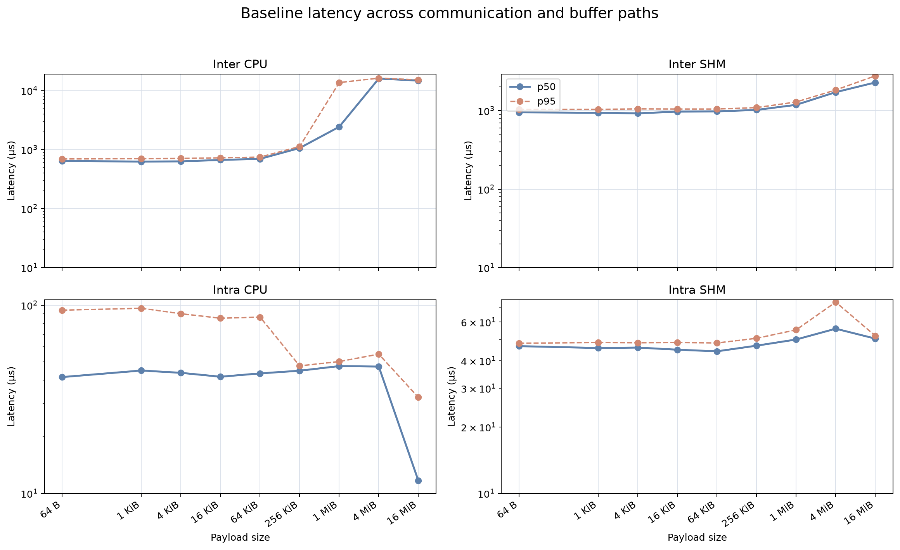
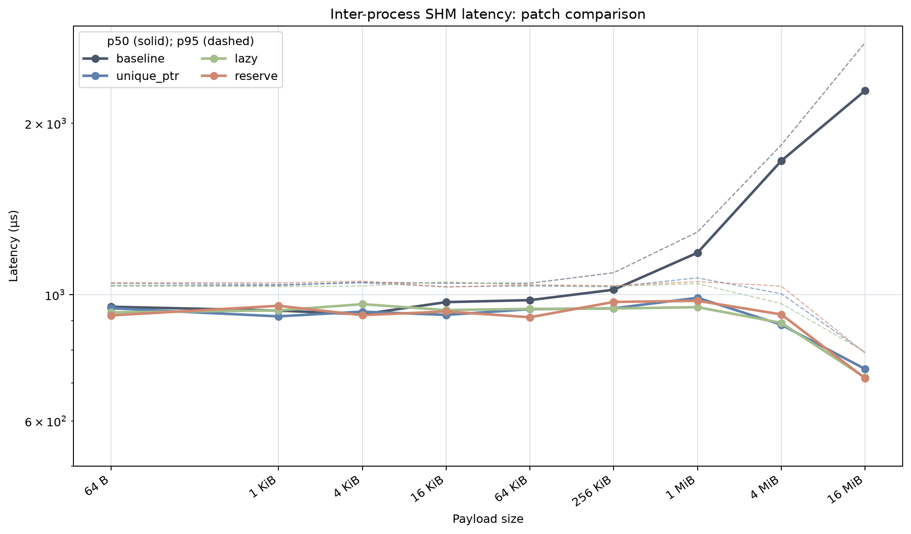
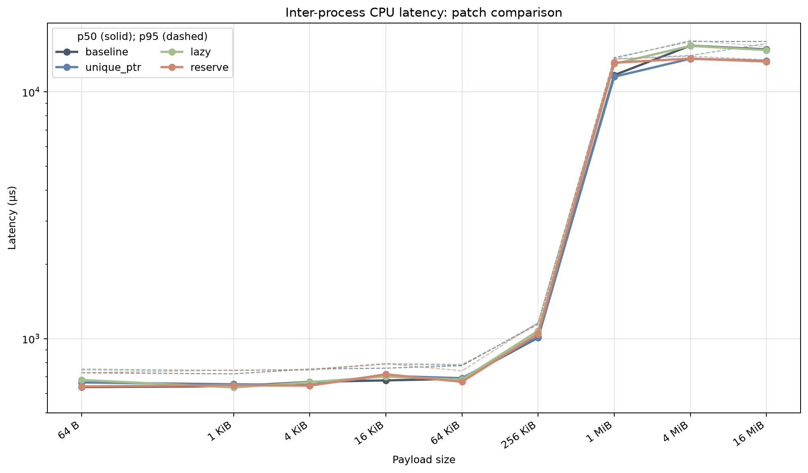
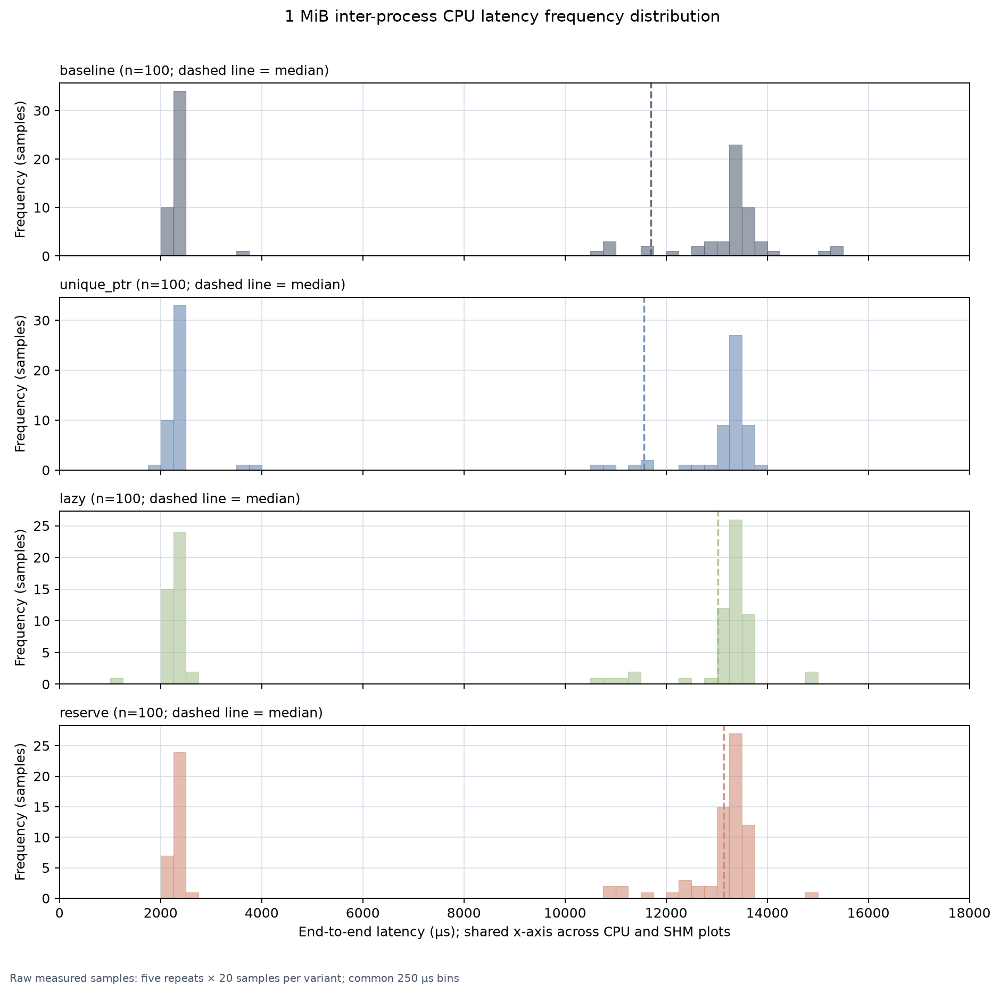
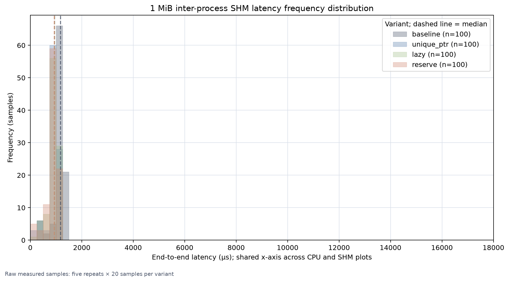
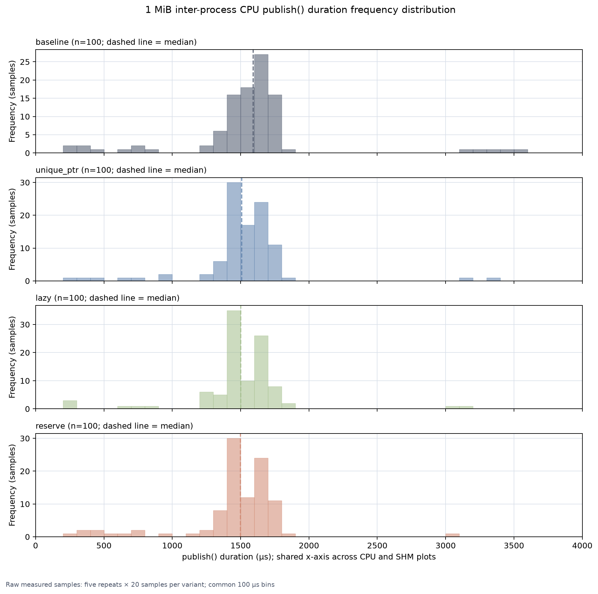
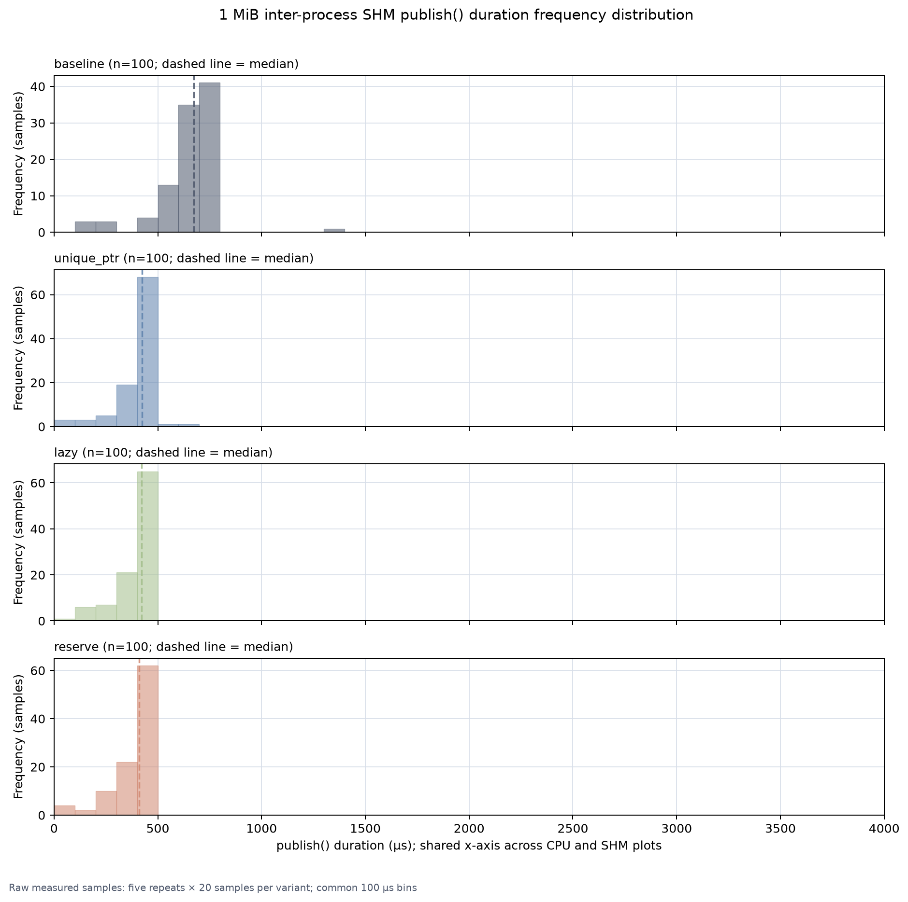

# 16-Way SHM Buffer Backend Benchmark Report

## Executive summary

This report uses the rerun in `../../benchmark-results-16way-rerun`, which
contains the four variants, nine payload sizes, four communication/backend
paths, and five repeats. Unlike the previous result set, this rerun also
contains the raw timing samples.

The main observations are:

- Inter-process CPU latency has a clear two-regime behavior at 1 MiB. The raw
  samples cluster near 2.3 ms and 13--14 ms, so a single aggregated p50 does
  not describe the behavior well.
- Inter-process SHM is slower than inter-process CPU for small payloads, but
  it avoids the large CPU-path latency regime. Baseline SHM p50 grows from
  1.16 ms at 1 MiB to 2.28 ms at 16 MiB.
- The three patches reduce the inter-process SHM p50 at 16 MiB to
  0.72--0.75 ms, a 67.2--68.4% reduction from baseline.
- The raw publish timing shows the same effect directly. At 1 MiB, SHM
  `publish()` p50 decreases from 672.6 µs for baseline to 410.1--423.4 µs
  for the patched variants.
- Intra-process latency is about 110--150 µs in this rerun. It is useful as a
  regression control, but it is not the target path for these patches.

## Measurement design

The matrix contains:

- 4 variants: baseline, `unique_ptr`, `lazy`, and `reserve`.
- 9 payload sizes: 64 B, 1 KiB, 4 KiB, 16 KiB, 64 KiB, 256 KiB, 1 MiB,
  4 MiB, and 16 MiB.
- 5 repeats per size/path combination.
- 30 messages per case at 10 Hz; 10 warm-up messages are excluded, leaving
  20 measured samples.
- 2 communication modes: `inter_process` and `intra_process_va`.
- 2 backends: `cpu` and `memfd` (called SHM below).

The summary contains 720 cases and the raw files contain 14,400 measured
sample rows. The summary table cells below are the median across five
repeats of each repeat's percentile, in microseconds, shown as `p50 / p95`.
The 1 MiB histograms use the 100 raw e2e latency samples for each variant and
backend directly.

The benchmark records two independent timing quantities:

- `publish_duration_ns`: the interval around the publisher's `publish()`
  boundary. Allocation and payload initialization happen before this interval.
- `e2e_latency_ns`: the message timestamp to the subscriber's receive-side
  payload access.

## Baseline across all paths

| Payload | Inter CPU | Inter SHM | Intra CPU | Intra SHM |
|---:|---:|---:|---:|---:|
| 64 B | 636.3 / 705.4 | 942.8 / 1,085.4 | 145.1 / 179.1 | 114.7 / 132.4 |
| 1 KiB | 641.3 / 706.3 | 940.2 / 1,057.4 | 120.4 / 160.3 | 114.6 / 143.3 |
| 4 KiB | 661.8 / 729.9 | 914.0 / 1,036.3 | 118.4 / 152.7 | 127.3 / 169.3 |
| 16 KiB | 668.7 / 758.9 | 921.5 / 1,046.1 | 123.4 / 163.3 | 119.7 / 135.6 |
| 64 KiB | 672.9 / 754.5 | 954.3 / 1,081.8 | 122.5 / 163.8 | 116.3 / 141.5 |
| 256 KiB | 1,009.1 / 1,153.5 | 1,036.1 / 1,121.0 | 114.3 / 131.8 | 116.8 / 128.2 |
| 1 MiB | 12,561.5 / 13,710.6 | 1,161.7 / 1,284.5 | 118.1 / 128.4 | 119.7 / 131.0 |
| 4 MiB | 15,502.1 / 15,939.4 | 1,707.7 / 1,801.6 | 108.2 / 115.4 | 129.5 / 149.7 |
| 16 MiB | 14,899.8 / 15,452.4 | 2,284.7 / 2,663.4 | 31.0 / 78.3 | 111.1 / 120.0 |

The baseline plot shows that the CPU path enters a multi-millisecond regime at
1 MiB and above. SHM avoids that regime, but its latency is not constant: the
baseline SHM p50 increases from 1,161.7 µs at 1 MiB to 2,284.7 µs at 16 MiB.
This is an observed size-dependent cost on the end-to-end path; it should not
be interpreted as proof of a payload-sized copy on the SHM wire path.



The same four-path p50 view is also available for each patched variant:

- [`unique_ptr`](./figures/unique_ptr-path-latency.png)
- [`lazy`](./figures/lazy-path-latency.png)
- [`reserve`](./figures/reserve-path-latency.png)

## Variant results across all paths

### `unique_ptr`

| Payload | Inter CPU | Inter SHM | Intra CPU | Intra SHM |
|---:|---:|---:|---:|---:|
| 64 B | 652.3 / 719.9 | 929.9 / 1,053.9 | 133.4 / 163.2 | 116.4 / 139.5 |
| 1 KiB | 648.8 / 713.0 | 941.3 / 1,056.3 | 123.7 / 168.2 | 116.8 / 134.8 |
| 4 KiB | 644.1 / 726.6 | 959.9 / 1,052.3 | 111.6 / 163.2 | 117.9 / 147.0 |
| 16 KiB | 703.0 / 787.2 | 936.3 / 1,043.2 | 120.2 / 158.2 | 116.0 / 134.1 |
| 64 KiB | 688.6 / 727.1 | 928.7 / 1,040.3 | 144.7 / 160.5 | 120.6 / 163.2 |
| 256 KiB | 1,032.0 / 1,127.9 | 937.4 / 1,043.2 | 114.1 / 137.3 | 117.7 / 128.8 |
| 1 MiB | 13,019.2 / 13,572.9 | 936.5 / 1,056.9 | 115.7 / 127.6 | 120.1 / 131.7 |
| 4 MiB | 13,631.8 / 13,999.6 | 884.8 / 1,011.5 | 107.0 / 121.6 | 131.9 / 149.6 |
| 16 MiB | 13,318.1 / 13,489.1 | 749.6 / 815.6 | 34.8 / 77.8 | 114.6 / 127.0 |

### `lazy`

| Payload | Inter CPU | Inter SHM | Intra CPU | Intra SHM |
|---:|---:|---:|---:|---:|
| 64 B | 690.6 / 749.0 | 948.5 / 1,058.2 | 121.8 / 159.0 | 118.2 / 127.6 |
| 1 KiB | 633.8 / 716.4 | 936.9 / 1,051.5 | 120.2 / 158.3 | 116.1 / 141.3 |
| 4 KiB | 663.9 / 742.4 | 942.9 / 1,058.6 | 115.0 / 161.3 | 118.5 / 133.3 |
| 16 KiB | 688.3 / 782.9 | 934.7 / 1,042.0 | 157.1 / 178.1 | 115.9 / 127.7 |
| 64 KiB | 689.8 / 785.9 | 937.4 / 1,036.1 | 114.0 / 140.2 | 112.8 / 128.2 |
| 256 KiB | 1,068.3 / 1,137.3 | 935.1 / 1,048.9 | 114.8 / 124.6 | 116.2 / 129.8 |
| 1 MiB | 11,039.5 / 13,609.3 | 916.4 / 1,049.9 | 116.8 / 129.8 | 120.9 / 131.1 |
| 4 MiB | 15,213.5 / 16,048.0 | 901.7 / 1,032.5 | 114.6 / 133.2 | 132.6 / 152.4 |
| 16 MiB | 14,775.9 / 15,206.7 | 724.3 / 801.5 | 41.6 / 79.0 | 113.6 / 120.3 |

### `reserve`

| Payload | Inter CPU | Inter SHM | Intra CPU | Intra SHM |
|---:|---:|---:|---:|---:|
| 64 B | 642.9 / 704.7 | 945.2 / 1,060.5 | 144.2 / 181.0 | 114.6 / 137.5 |
| 1 KiB | 639.6 / 732.3 | 932.3 / 1,059.7 | 138.4 / 165.3 | 114.8 / 126.3 |
| 4 KiB | 639.9 / 731.3 | 897.7 / 1,038.0 | 124.2 / 154.7 | 115.3 / 153.7 |
| 16 KiB | 708.5 / 773.9 | 929.7 / 1,053.7 | 143.6 / 175.0 | 114.7 / 127.0 |
| 64 KiB | 685.4 / 736.7 | 917.1 / 1,044.3 | 115.1 / 157.0 | 116.7 / 133.0 |
| 256 KiB | 1,068.3 / 1,136.6 | 898.2 / 1,028.7 | 114.8 / 147.1 | 115.1 / 126.1 |
| 1 MiB | 12,804.1 / 13,584.9 | 933.6 / 1,043.7 | 117.5 / 128.9 | 120.4 / 137.0 |
| 4 MiB | 13,646.1 / 13,921.1 | 889.1 / 977.2 | 106.3 / 119.0 | 129.6 / 149.5 |
| 16 MiB | 13,272.6 / 13,499.8 | 722.4 / 804.2 | 64.7 / 78.8 | 116.5 / 128.2 |

The CPU regression-control results do not show a consistent patch effect. The
SHM results do: at 16 MiB, all three patches reduce p50 by about two thirds.
The geometric-mean p50 ratios versus baseline are:

| Variant | Inter CPU | Inter SHM | Intra CPU | Intra SHM |
|---|---:|---:|---:|---:|
| `unique_ptr` | 0.989× | 0.795× | 1.012× | 1.002× |
| `lazy` | 1.003× | 0.792× | 1.035× | 0.995× |
| `reserve` | 0.987× | 0.781× | 1.116× | 0.989× |





## 1 MiB raw latency distributions

The following figures are histograms of the 100 raw e2e latency samples for
each variant: five repeats with 20 measured samples per repeat. The bins are
250 µs wide and both figures use the same 0--18,000 µs x-axis. Dashed lines
show the raw-sample median.



The CPU histogram makes the two regimes visible. Most samples are around
2.3--2.5 ms or 13--14 ms, with the relative frequency varying by variant.
This is why the 1 MiB p50 is not a reliable description of one fixed latency
mode. The p95 remains in the slower regime for every variant.



The SHM histogram is concentrated around 0.8--1.3 ms. The baseline is shifted
to the right, while the patched variants overlap around 0.9--1.0 ms.

### 1 MiB publish-side timing

The raw publish timing supports the interpretation that the patch changes work
inside the publisher path, not merely subscriber scheduling:

| Backend / metric | Baseline | `unique_ptr` | `lazy` | `reserve` |
|---|---:|---:|---:|---:|
| CPU `publish()` p50 / p95 | 1,589.3 / 1,801.1 µs | 1,507.6 / 1,740.2 µs | 1,499.0 / 1,731.8 µs | 1,497.3 / 1,756.1 µs |
| SHM `publish()` p50 / p95 | 672.6 / 754.7 µs | 423.4 / 477.4 µs | 421.5 / 474.4 µs | 410.1 / 476.4 µs |
| SHM e2e p50 / p95 | 1,172.9 / 1,298.2 µs | 943.2 / 1,057.1 µs | 935.6 / 1,050.5 µs | 923.7 / 1,056.9 µs |

This does not yet identify every allocation or serialization operation that
causes the baseline cost. It does show that the reduction is already visible
around `publish()`, and that the e2e improvement follows the same direction.

The publish-only raw distributions are shown below. These use the same
four-row layout and common 100 µs bins; their x-axis is shared between CPU and
SHM and spans 0--4,000 µs.





## Limitations and interpretation

The SHM path is not demonstrated to be strictly constant-time with respect to
payload size. The safe conclusion is narrower: the patch removes most of the
observed large-buffer growth in this benchmark. The remaining end-to-end
latency includes DDS discovery, executor scheduling, queueing, and process
startup effects.

The 1 MiB histograms are raw e2e samples, but the tables still use the
benchmark's percentile calculation. With 20 samples per repeat, p95 and p99
use the same order statistic, so they should not be treated as independent
tail metrics. The raw CSV files should be preferred for future distribution
analysis.

## Reproduction and data

The rerun summary files are:

- [baseline.csv](../../benchmark-results-16way-rerun/baseline.csv)
- [unique_ptr.csv](../../benchmark-results-16way-rerun/unique_ptr.csv)
- [lazy.csv](../../benchmark-results-16way-rerun/lazy.csv)
- [reserve.csv](../../benchmark-results-16way-rerun/reserve.csv)

The raw files are in
[`../../benchmark-results-16way-rerun/raw/`](../../benchmark-results-16way-rerun/raw/).

Figures can be regenerated from the rerun with the workspace virtual
environment:

```bash
source .venv/bin/activate
python src/memfd_buffer_backend/tools/plot_benchmark_report.py \
  --data-dir benchmark-results-16way-rerun
```

The 16-way rerun itself is orchestrated with:

```bash
source ~/ros2_lyrical/install/setup.bash
source install/setup.bash
ros2 run memfd_buffer_backend_benchmark run_16way_benchmark.py \
  --output-dir benchmark-results-16way-rerun \
  --overwrite
```
