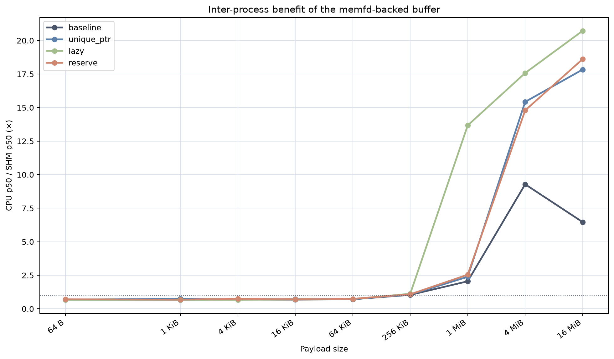

# 16-Way SHM Buffer Backend Benchmark Report

## Executive summary

This rerun evaluates the four requested communication/backend paths at a 10 Hz
publication rate, using the current `rmw_fastrtps` `lyrical` commit
`1aaf7d38dbf4ca34ae208b4aa63d1290deb8c17b` (`1aaf7d3`). The three patches were
applied independently to that baseline.

The rerun confirms the previous conclusion:

- Intra-process communication is the fastest path, with typical p50 latency in
  the tens of microseconds. The `memfd` backend adds a small end-to-end cost in
  many cases.
- For inter-process communication, the CPU fallback becomes much slower for
  multi-megabyte payloads. The baseline reaches 16.0 ms at 4 MiB and 14.8 ms
  at 16 MiB in this rerun.
- Inter-process `memfd` is substantially faster for large buffers, but baseline
  latency still grows from 1.19 ms at 1 MiB to 2.28 ms at 16 MiB.
- All three `rmw_fastrtps_cpp` alternatives remove most of that large-buffer
  growth. Their 16 MiB inter-process `memfd` p50 is 0.71–0.74 ms.
- The regression-control paths do not show a consistent degradation. The
  strongest effect remains localized to inter-process publication through the
  non-CPU backend.

The figures below summarize the same median-across-repeats data used in the
tables. Solid lines show p50 latency; dashed lines show p95 where both are
shown. The x-axis is logarithmic in payload size, and latency plots use a
logarithmic y-axis so that intra-process and inter-process paths can be read in
the same figure.

## Measurement design

The matrix contains:

- 4 variants: baseline, `unique_ptr`, `lazy`, and `reserve`.
- 9 payload sizes: 64 B, 1 KiB, 4 KiB, 16 KiB, 64 KiB, 256 KiB, 1 MiB,
  4 MiB, and 16 MiB.
- 5 repeats per size/path combination.
- 30 messages per case at 10 Hz; 10 warm-up messages are excluded, leaving
  20 measured samples.
- 2 communication modes: `inter_process` and `intra_process_va`.
- 2 backends: `cpu` and `memfd` (called SHM in the discussion below).

Thus, the complete run contains:

```text
4 variants × 9 sizes × 5 repeats × 2 communication modes × 2 backends
= 720 cases
```

The baseline is unmodified `origin/lyrical` at `1aaf7d3`. Each patch is an
alternative built independently from that baseline, not a cumulative patch
stack:

| Variant | Change |
|---|---|
| baseline | Unmodified `origin/lyrical` |
| `unique_ptr` | `0001-fastrtps-reuse-unique-ptr-buffer.patch` |
| `lazy` | `0002-fastrtps-reuse-fastbuffer-lazy.patch` |
| `reserve` | `0003-fastrtps-reuse-fastbuffer-reserve.patch` |

The values in the tables are the median across the five repeats of each
repeat's percentile. Each cell is `p50 / p95` in microseconds.

## 1. Benefits of the SHM buffer backend

### Baseline across all paths

| Payload | Inter CPU | Inter SHM | Intra CPU | Intra SHM |
|---:|---:|---:|---:|---:|
| 64 B | 643.1 / 694.0 | 952.6 / 1,036.6 | 41.5 / 94.0 | 46.6 / 48.0 |
| 1 KiB | 626.2 / 703.8 | 938.0 / 1,038.4 | 44.9 / 96.2 | 45.7 / 48.4 |
| 4 KiB | 632.0 / 709.1 | 924.1 / 1,052.0 | 43.7 / 90.0 | 45.9 / 48.3 |
| 16 KiB | 667.9 / 725.5 | 970.6 / 1,047.9 | 41.6 / 85.2 | 44.9 / 48.4 |
| 64 KiB | 697.4 / 747.1 | 978.5 / 1,047.8 | 43.4 / 86.4 | 44.2 / 48.2 |
| 256 KiB | 1,062.4 / 1,128.8 | 1,020.6 / 1,093.2 | 44.8 / 47.6 | 46.8 / 50.6 |
| 1 MiB | 2,433.3 / 13,675.6 | 1,185.4 / 1,289.1 | 47.4 / 50.1 | 50.0 / 55.3 |
| 4 MiB | 15,958.3 / 16,229.9 | 1,719.0 / 1,833.2 | 47.1 / 54.9 | 55.9 / 73.9 |
| 16 MiB | 14,769.5 / 15,218.9 | 2,283.5 / 2,773.0 | 11.7 / 32.4 | 50.4 / 51.9 |

Intra-process results remain the fastest overall, generally around 40–60 µs
p50. The SHM/memfd intra-process path is slightly slower than CPU at many
sizes; for example, at 4 MiB the p50 is 55.9 µs versus 47.1 µs. This supports
the expected small bookkeeping overhead, although the difference is small
relative to end-to-end scheduling variability.

For inter-process communication, the CPU path changes to a much slower regime
at multi-megabyte sizes. At 16 MiB, inter-process SHM is 6.5× faster than CPU
by p50 (2.28 ms versus 14.77 ms). At 4 MiB the advantage is 9.3×.

The SHM path is therefore beneficial for large same-host buffers: the
subscriber can access the shared payload without moving the full payload
through the normal CPU-backed path. Baseline SHM is not constant-time,
however; its large-buffer publish path is the subject of the next section.

## 2. Large-buffer publish behavior with the SHM backend

### Observed problem

Baseline inter-process SHM p50 increases with payload size:

| Payload | 1 MiB | 4 MiB | 16 MiB |
|---:|---:|---:|---:|
| Baseline inter-process SHM p50 | 1,185.4 µs | 1,719.0 µs | 2,283.5 µs |

This size dependence is consistent with avoidable work in the RMW publish path,
where a temporary serialization buffer is prepared even when the downstream
SHM endpoint can use shared storage.

### Patch comparison on the target path

| Payload | Baseline | `unique_ptr` | `lazy` | `reserve` |
|---:|---:|---:|---:|---:|
| 1 MiB | 1,185.4 / 1,289.1 | 987.9 / 1,070.7 | 951.1 / 1,045.9 | 975.8 / 1,054.5 |
| 4 MiB | 1,719.0 / 1,833.2 | 885.7 / 1,004.1 | 892.4 / 964.7 | 923.5 / 1,035.7 |
| 16 MiB | 2,283.5 / 2,773.0 | 740.6 / 791.6 | 715.3 / 793.2 | 713.3 / 790.0 |

At 16 MiB, the p50 reduction versus baseline is 67.6% for `unique_ptr`, 68.7%
for `lazy`, and 68.8% for `reserve`. The patched results are approximately
0.7–1.0 ms over the 1–16 MiB range, much closer to constant-time behavior than
the baseline.

The rerun therefore confirms the large-buffer publish problem and confirms that
all three alternatives address its dominant cost. It does not establish that
one patch is universally best: `lazy` and `reserve` are marginally lower at
16 MiB, while the differences between patched variants are small compared with
the total end-to-end path.

### Figures


*Figure 1. Baseline p50 latency across the four paths. Intra-process
communication stays in the tens-of-microseconds range, while inter-process CPU
communication enters a millisecond-scale regime for multi-megabyte payloads.*


*Figure 2. Inter-process SHM p50 and p95 for the baseline and the three
`rmw_fastrtps_cpp` alternatives. The patched paths flatten the large-buffer
increase visible in the baseline.*



*Figure 3. Inter-process p50 speedup, computed as CPU latency divided by SHM
latency. Values above 1× indicate a benefit from the memfd-backed path.*

## 3. `rmw_fastrtps_cpp` fix and regression check

The following ratios compare each variant's median p50 at each size with the
baseline, then take the geometric mean over the nine sizes. Counts are
`faster / within ±2% / slower` and are descriptive, not significance tests.

| Variant | Inter CPU | Inter SHM | Intra CPU | Intra SHM |
|---|---:|---:|---:|---:|
| `unique_ptr` | 0.975×; 5 / 2 / 2 | 0.787×; 7 / 2 / 0 | 0.990×; 4 / 3 / 2 | 0.988×; 4 / 4 / 1 |
| `lazy` | 1.200×; 1 / 7 / 1 | 0.787×; 7 / 1 / 1 | 1.011×; 2 / 4 / 3 | 0.999×; 2 / 5 / 2 |
| `reserve` | 0.985×; 3 / 3 / 3 | 0.787×; 7 / 2 / 0 | 0.985×; 4 / 4 / 1 | 0.973×; 5 / 4 / 0 |

The direct target path, inter-process SHM, improves consistently: every patch
has a geometric-mean p50 of about 0.79× baseline, and none is slower than
baseline at more than two percent at any of the nine size points except one
`lazy` point. The large-buffer table shows why this is the important result.

The CPU inter-process and both intra-process columns are regression controls.
They do not show a systematic degradation across the alternatives. The
`lazy` CPU inter-process ratio is elevated by run-to-run variation in this
rerun, despite seven of its nine size points being within two percent of
baseline; it is not evidence that the patch changes the CPU path's intended
large-buffer behavior.

## Validation and limitations

All four copied CSV files contain 180 rows, giving 720 rows in total. Every
row reports `received=30` and `measured=20`, so the requested message-count and
warm-up configuration is present throughout the dataset. Every
`intra_process_va` row also reports `va_matches=30`, confirming the expected
publisher/subscriber address sharing for all 30 messages. The raw files are:

- [baseline.csv](./benchmark-results-16way/baseline.csv)
- [unique_ptr.csv](./benchmark-results-16way/unique_ptr.csv)
- [lazy.csv](./benchmark-results-16way/lazy.csv)
- [reserve.csv](./benchmark-results-16way/reserve.csv)

The figures can be regenerated with the workspace virtual environment:

```bash
source .venv/bin/activate
python src/memfd_buffer_backend/tools/plot_benchmark_report.py
```

This remains an end-to-end measurement on one host. DDS discovery, executor
scheduling, and CPU affinity can affect the reported percentiles. The result
supports the performance direction and the absence of an obvious regression;
it is not a substitute for focused correctness tests, concurrent-publish
tests, or component-level allocation/serialization timing.

## Reproduction

The 720-case orchestration script is installed as
`run_16way_benchmark.py`. It starts from `origin/lyrical`, applies each patch
independently, builds separate Release prefixes, runs all four paths, and
restores the original `rmw_fastrtps` checkout. The default invocation is:

```bash
source ~/ros2_lyrical/install/setup.bash
source install/setup.bash
ros2 run memfd_buffer_backend_benchmark run_16way_benchmark.py \
  --output-dir benchmark-results-16way-rerun \
  --overwrite
```
