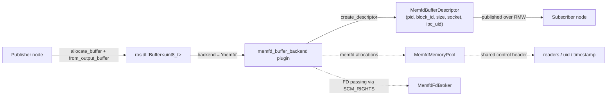
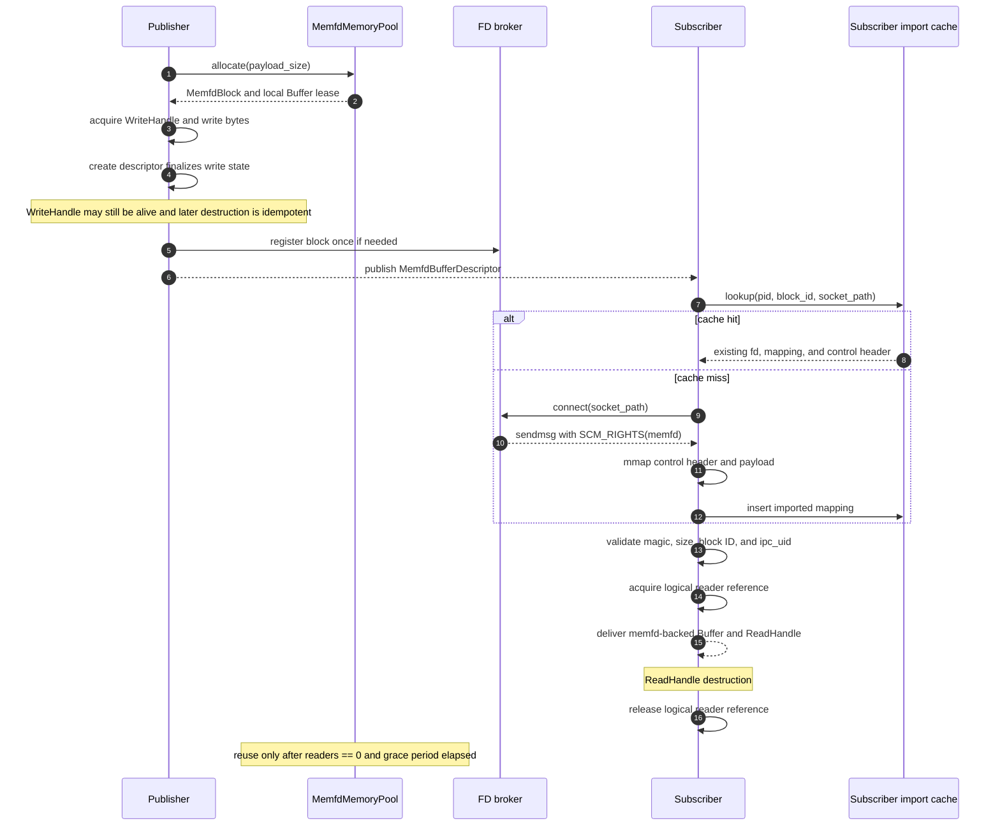
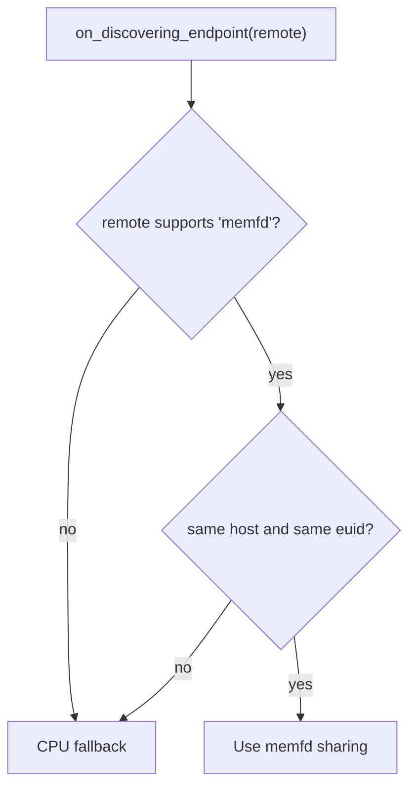
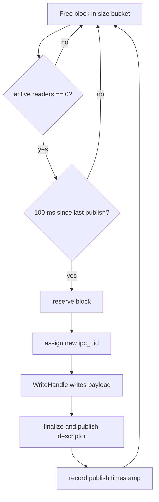
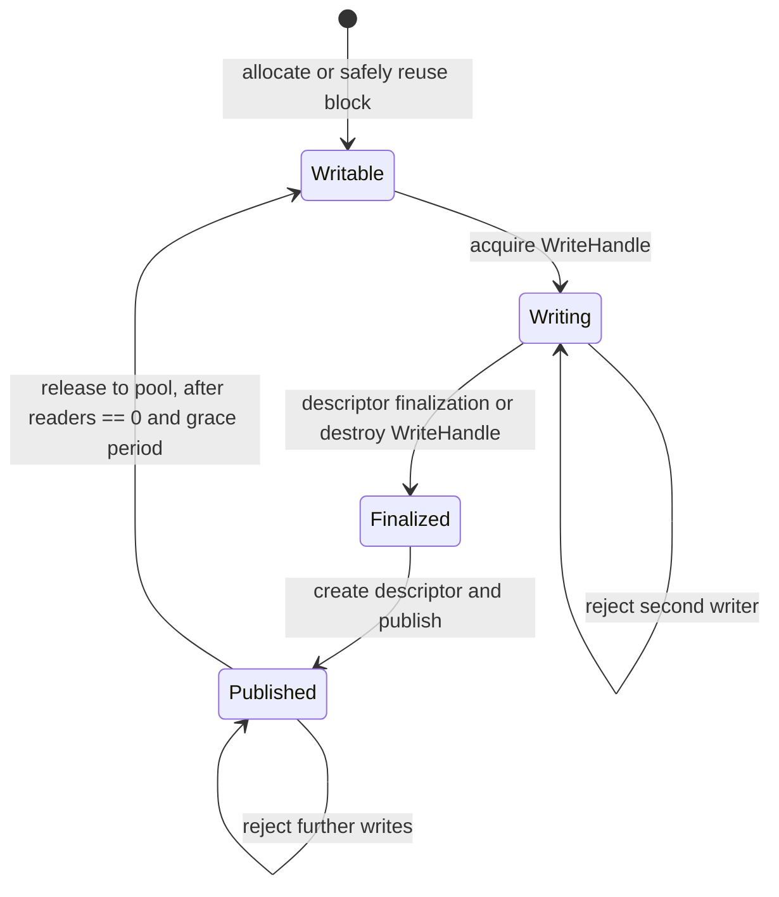

# Design

## Introduction

`memfd_buffer_backend` is a Linux-only `rosidl::Buffer<T>` storage backend
that places the payload in an anonymous Linux `memfd` and shares the backing
object between compatible ROS 2 endpoints. The ROS message carries a small
descriptor; the payload itself is transferred by mapping the same memory
object in the subscriber process. When the runtime conditions do not permit
the optimized path, the backend falls back to the normal CPU buffer path.

The optimized path is intended for endpoints on the same host and under the
same Linux user. It supports both intra-process use and inter-process use on
the same host. A memfd is not a named shared-memory object: it has no global
name that must be unlinked by an elected owner. The kernel keeps the backing
object alive while file-descriptor or mapping references exist and reclaims it
after the last reference disappears.

The backend must preserve the following ownership rule:

> A `rosidl::Buffer` owns a logical use of a pool block, while the kernel owns
> the lifetime of the underlying memfd object through its reference count.

The pool still needs a logical reader count and a publication grace period to
avoid overwriting a block while a subscriber is reading it. Those counters
protect reuse; they are not a replacement for kernel-owned resource
cleanup.

## High-level architecture



The implementation is divided into four responsibilities:

- `MemfdMemoryPool` owns publisher-side blocks. It groups reusable blocks by
  payload size and keeps each block's memfd, mapping, stable block ID, control
  header, and broker registration together.
- `MemfdFdBroker` exposes a block's live memfd through a private Unix-domain
  socket and sends it with `SCM_RIGHTS`. The server is reusable: every cache
  miss may request the same block FD, and no per-message lease token is
  required.
- `MemfdHandleCache` owns imported mappings and their received FDs in the
  subscriber process. A cache hit reuses the existing mapping and does not
  perform another FD transfer.
- `MemfdBufferBackend` integrates the storage layer with the
  `rosidl::BufferBackend` plugin interface, performs endpoint capability
  decisions, creates descriptors, imports descriptors, and selects CPU
  fallback when necessary.

The broker socket is a rendezvous mechanism only. It may require best-effort
filesystem cleanup, but it does not own the lifetime of the payload. The
payload lifetime is determined by memfd FD and mapping references.

## Publish / subscribe flow



The first descriptor for a block causes the subscriber to request and map the
memfd. Later publications from the same pool block reuse the cached mapping.
The descriptor's `ipc_uid` is checked on every publication, so cache reuse does
not weaken stale-message detection.

## IPC capability decision

The backend advertises backend metadata containing the local host identity and
effective user ID, for example `<hostname>:<euid>`. The endpoint decision is
conservative: an optimized memfd path is selected only when the remote endpoint
advertises `memfd` with the same metadata.



This policy intentionally does not attempt cross-host FD transfer or
cross-user access. Endpoint discovery does not probe pool capacity or runtime
syscall availability. Failures in `memfd_create`, allocation, broker setup,
`SCM_RIGHTS` transfer, or mapping are handled at the operation that needs them
and select CPU fallback or allocation failure as appropriate.

## Descriptor contract

`MemfdBufferDescriptor` identifies a publication and supplies enough
information for a subscriber to obtain and validate the corresponding
mapping. The descriptor does not contain an FD; FDs are transferred only over
the broker socket.

| Field | Meaning |
|---|---|
| `size` | Logical payload size in bytes exposed as the `rosidl::Buffer` size. |
| `element_type_name` | Runtime element-type check, initially `uint8_t`. |
| `memfd_pid` | Publisher process ID used as part of the block identity. |
| `memfd_block_id` | Stable block ID within the publisher process and pool lifetime. |
| `memfd_block_size` | Total mapped region size, including the control header and payload. |
| `memfd_socket_path` | Private Unix-domain socket used to receive the memfd via `SCM_RIGHTS`. |
| `ipc_uid` | Non-zero publication UID used to reject a descriptor for an older reuse generation. |

The cache key must identify the physical imported block, not an individual
publication. It therefore includes the publisher process identity, stable
block ID, and broker socket path, but not `ipc_uid`. The UID remains a
per-publication validation value.

The descriptor is created only after the publisher has finalized its write and
stored the current UID in the control header. The subscriber must validate the
descriptor against the control header before returning a buffer to user code:
returning a buffer to user code:

- ABI magic and control-header version match.
- Block ID and payload size match the descriptor.
- The control-header UID equals `ipc_uid`.

Any mismatch is a stale or invalid publication and must not expose the mapping
as a valid memfd buffer.

## Memfd ownership and rejected alternatives

### Chosen: anonymous memfd sharing

The publisher creates a memfd, sizes it once, maps it with `MAP_SHARED`, and
keeps the publisher-side FD in the pool block. The broker sends the same FD to
subscribers using `SCM_RIGHTS`; receiving a descriptor creates another kernel
reference to the same anonymous file object. Each imported mapping and FD is
owned by an RAII object in the subscriber process.

The publisher does not need to know which subscriber is the last owner. If the
publisher exits, its FD and broker-owned references are closed, but a
subscriber that still has a received FD or mapping can continue to use the
payload. When the last process releases its FD and mapping, the kernel
reclaims the memfd object. This also handles publisher or subscriber failure
without a separate orphaned shared-memory cleanup protocol.

### Rejected: POSIX named shared memory

The payload and its control metadata must not be allocated with
`shm_open()`/`shm_unlink()` or another globally named POSIX shared-memory
object. A named object remains in the namespace until an explicit unlink, so a
design based on named shared memory needs an owner-election or last-owner
protocol. In ROS 2, the final subscriber is not known to the publisher, and a
subscriber-side “unlink if I am last” check races with endpoint discovery,
message delivery, process termination, and fan-out. Crash recovery would then
need orphan scanning or a separate liveness mechanism.

This backend deliberately avoids that ownership problem. The Unix socket path
is only a temporary FD-distribution endpoint; it is not the name of the memory
object and must not be confused with POSIX named shared memory.


## Memory pool and block lifetime

Each `MemfdBlock` contains:

- one memfd FD and one publisher-side shared mapping;
- a stable process-local `memfd_block_id`;
- a fixed payload size and total mapping size;
- a control header at the beginning of the mapping;
- a broker registration for repeated FD distribution; and
- the current publication UID and pool state.

The pool maintains free lists keyed by payload size. Allocation first searches
the bucket for a block that is safe to reuse; if none is available, it creates
a new memfd block. A block is never resized in place. The pool may keep extra
blocks when subscribers delay release, and may reclaim them when the pool is
explicitly destroyed.

The control header contains the minimum shared state needed for publication
validation and reuse protection:

```text
magic / ABI version
block_id / payload_size
ipc_uid
active_reader_count
publish_timestamp
```

The descriptor creation path must complete `WriteHandle` finalization before
constructing and publishing the descriptor. The handle object may remain alive
after this point, but the publisher must not modify the payload. The header's
atomics must be suitable for Linux inter-process use and must not require a
process-local mutex.



The 100 ms grace period is the same safety window used by the CUDA backend.
It protects against a descriptor that has been published but has not yet
reached a subscriber. The period is not a delivery guarantee: a descriptor
that arrives after the block has been reused is rejected by UID validation.

The pool's logical reader count is necessary even though memfd itself is
reference-counted. Kernel references guarantee that the bytes remain mapped;
they do not tell the publisher whether a subscriber is still reading before
the next publication. The count therefore protects against concurrent reuse,
while the memfd reference count handles final object cleanup.

## Memfd buffer state machine

The write lifecycle is tracked by a process-local state in `MemfdBufferImpl`.
This state is not stored in the shared memfd control header and is never
observed by the subscriber. Its purpose is to ensure that the backend cannot
create a descriptor before the write is finalized. Finalization may happen
explicitly during descriptor creation while a `WriteHandle` is still alive, or
from the handle destructor as the normal RAII fallback.



The states have the following meaning:

- `Writable`: the local buffer may acquire one write handle.
- `Writing`: one publisher-side `WriteHandle` owns mutable access. Descriptor
  creation first performs an idempotent finalization if the state is still
  `Writing`.
- `Finalized`: write finalization has completed and all synchronous CPU writes
  are complete. The C++ `WriteHandle` object may still be alive, and descriptor
  creation is now permitted. The caller must not modify the payload after
  publication, even if the handle's mutable pointer remains available.
- `Published`: the descriptor has been created and the payload is immutable
  for this publication. The block can return to `Writable` only after its
  logical readers are gone and the 100 ms grace period has elapsed.

When a block is reserved for reuse, its `ipc_uid` is changed before the next
write begins so descriptors for the previous publication become stale. The
state transition is process-local; `ipc_uid`, `active_reader_count`, and
`publish_timestamp` remain the shared cross-process lifetime metadata.

## WriteHandle and ReadHandle

The public access pattern follows the CUDA backend, with CPU shared-memory
synchronization replacing CUDA stream synchronization.

### WriteHandle

`from_output_buffer()` returns a move-only `WriteHandle` with a mutable
`uint8_t *` pointer. It acquires exclusive write access and rejects a second
concurrent writer or a write after finalization. Descriptor creation performs
the write finalization before constructing the descriptor, so the publisher
does not have to destroy the handle before calling `publish()`. The operation
is idempotent; destroying a still-live handle later is a no-op after explicit
finalization. The publisher must not modify the payload after publication,
even if the handle's mutable pointer remains available.

There is no CUDA stream argument, event allocation, event record, or event
enqueue. Finalization only changes local state; it is not an asynchronous
completion mechanism.

### ReadHandle

`from_input_buffer()` returns a move-only `ReadHandle` with a const pointer. It
holds the imported mapping/cache entry and one logical reader reference for
the duration of the handle. Its destructor releases that reference. It does
not enqueue a read event, wait for a stream, or use a deferred event recycler.

The caller must keep the handle alive for the entire period in which the
returned pointer is accessed. Accessing the pointer after handle destruction
or concurrently modifying it is outside the backend contract.

### Promotion and CPU buffers

The API accepts generic `rosidl::Buffer<T>` values just as the CUDA API does:

- `from_output_buffer()` promotes a non-memfd buffer to a fresh pooled memfd
  buffer without copying, because the caller is about to overwrite it. The
  caller replaces the message field with the promoted buffer held by the
  handle.
- `from_input_buffer()` promotes a non-memfd buffer by allocating a pooled
  memfd buffer and performing a synchronous CPU `memcpy` into it. The returned
  read handle then exposes the memfd-backed copy.

The promotion path is an adaptation path, not the zero-copy inter-process
transport path.

## Subscriber import cache and lifetime

`MemfdHandleCache` stores an imported region containing:

- the received memfd FD;
- the `mmap()` base and total mapping size;
- a pointer to the validated control header; and
- the stable physical-block cache key.

On a cache miss, the subscriber requests one FD from the broker, maps it, and
validates the descriptor. On a cache hit, it reuses the FD and mapping but
still validates the current `ipc_uid` for the incoming
publication. A cache entry may outlive an individual `ReadHandle`; the handle
owns the logical reader reference, while the cache owns the imported mapping.

Cache insertion must be synchronized. If concurrent callbacks import the same
block, only one mapping is retained and any duplicate temporary FD/mapping is
released immediately. Cache eviction or process teardown closes the FD and
unmaps the region after active handles have released their references.

The cache is intentionally independent of the pool's free-list. A subscriber
may retain a mapping after the publisher reuses the block; the UID check keeps
old descriptors from being interpreted as the new publication. The publisher
must keep a stable block/socket identity for the lifetime of a cached mapping
and must not silently replace the memfd behind an existing cache key.

## Backend plugin behavior

`MemfdBufferBackend` implements the standard `rosidl::BufferBackend` hooks:

1. `get_backend_type()` returns `memfd`.
2. `get_backend_metadata()` returns the host and effective-user identity used
   by endpoint discovery.
3. `on_discovering_endpoint()` selects memfd only for compatible endpoints.
4. `create_descriptor_with_endpoint()` finalizes the source buffer's write
   state, registers its block with the broker, and creates a descriptor
   containing the block identity and current UID.
5. `from_descriptor_with_endpoint()` obtains or reuses the imported mapping,
   validates the control header, acquires a reader reference, and returns a
   memfd-backed `BufferImpl` with an RAII deleter.

If any optimized-path precondition fails, the hook returns a CPU-backed
implementation or declines the memfd descriptor so the normal RMW fallback
can serialize the payload. Import errors must not expose partially mapped or
unvalidated memory.

## Failure and shutdown behavior

- `memfd_create`, `ftruncate`, `mmap`, broker setup, or FD transfer failure
  selects CPU fallback or reports allocation failure to the caller.
- A malformed descriptor, ABI mismatch, size mismatch, invalid block ID, or
  UID mismatch is rejected as stale data.
- The publisher stops accepting new broker requests before destroying a pool
  block and removes the socket path as a best-effort filesystem cleanup.
- Closing the publisher FD does not force-delete a payload still referenced by
  a subscriber. The kernel reclaims the memfd only after all FD and mapping
  references are gone.
- Pool destruction must not overwrite or unmap a block while an active local
  buffer or logical reader reference still owns it. If a safe shutdown cannot
  be established, the block is quarantined until process exit rather than
  being reused unsafely.

## Related implementation areas

The design is derived from these repository-local sources:

- `src/rosidl_buffer_backends/docs/cuda_buffer_backend_design.md` for the
  document structure and lifecycle diagrams.
- `src/rosidl_buffer_backends/cuda_buffer_backend/cuda_buffer/` for the
  size-aware memory pool, persistent FD dispatcher, import cache, UID/stale
  validation, and `WriteHandle` / `ReadHandle` API shape.
- `src/rosidl_memfd_buffer_backend/memfd_buffer/` and
  `src/rosidl_memfd_buffer_backend/memfd_buffer_backend/` for the previous
  memfd mapping, control-header, broker, descriptor, and plugin PoC.
- `src/memfd_buffer_backend/memfd_buffer_backend_msgs/msg/MemfdBufferDescriptor.msg`
  for the current descriptor field names in the new backend workspace.

The previous PoC is implementation evidence, not the final ownership
contract.

## Validation plan

The implementation should provide coverage for the following scenarios:

- allocation and reuse of same-size pool blocks, with separate buckets for
  different payload sizes;
- refusal to reuse a block while a `ReadHandle` is active or while the 100 ms
  grace period has not elapsed;
- successful multi-subscriber FD distribution and cache-hit mapping reuse;
- payload-size, block-ID, ABI, and UID validation failures;
- stale descriptor rejection after block reuse;
- write finalization followed by visible subscriber reads without CUDA event
  operations;
- same-host/same-user capability selection and CPU fallback for incompatible
  endpoints; and
- cleanup after publisher or subscriber process termination without a named
  shared-memory orphan cleanup protocol.
