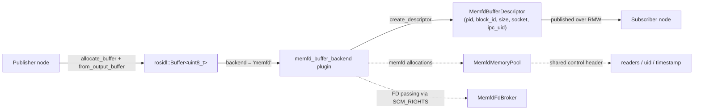
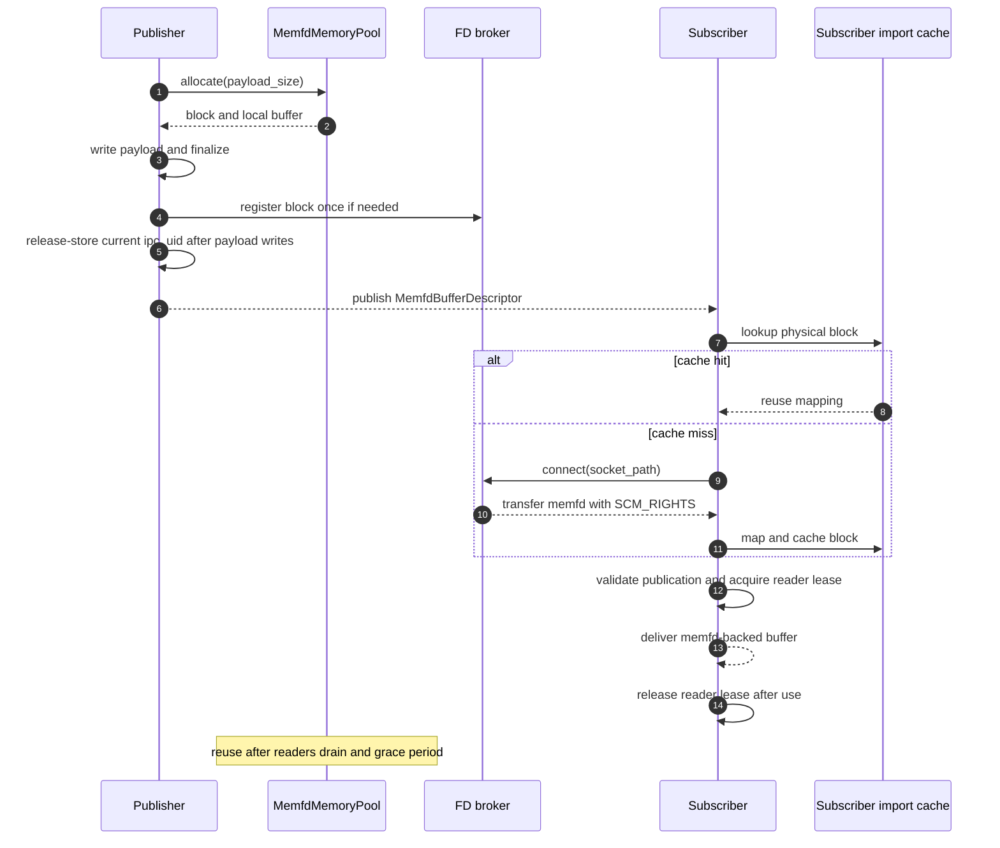
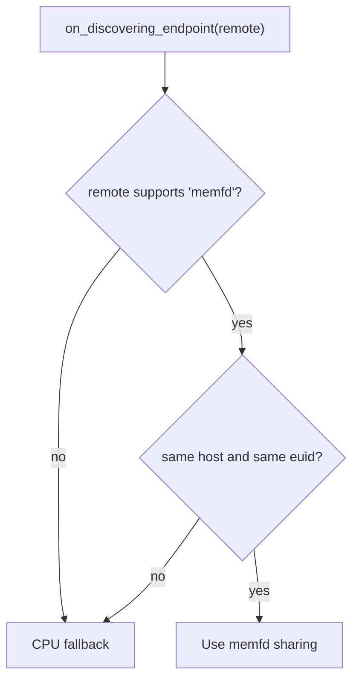
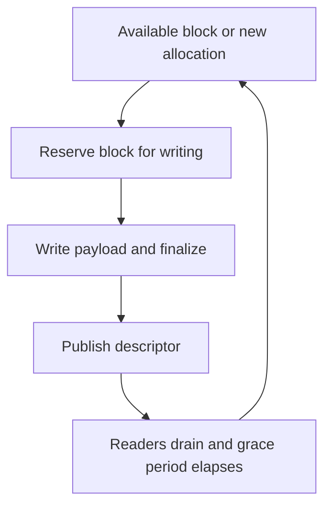
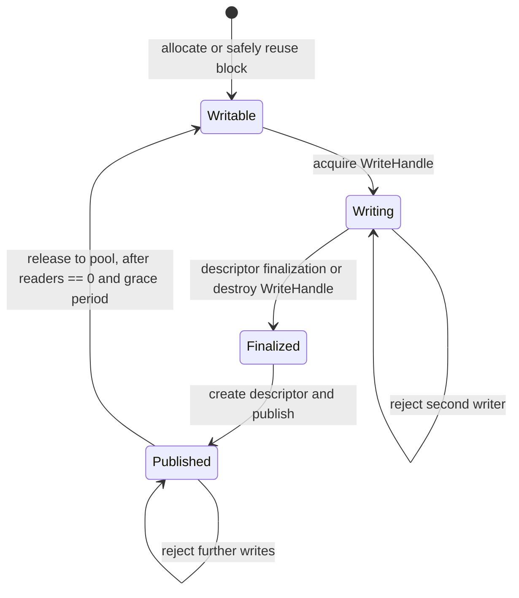

# Design

## Introduction

`memfd_buffer_backend` is a Linux-only `rosidl::Buffer<T>` storage backend
that places the payload in an anonymous Linux `memfd` and shares the backing
object between compatible ROS 2 endpoints. The ROS message carries a small
descriptor; the payload itself is transferred by mapping the same memory
object in the subscriber process. When the runtime conditions do not permit
the optimized path, the backend falls back to the normal CPU buffer path.

The optimized path is intended for endpoints on the same host and under the
same Linux user. It supports both intra-process use and inter-process use on
the same host. A memfd is not a named shared-memory object: it has no global
name that must be unlinked by an elected owner. The kernel keeps the backing
object alive while file-descriptor or mapping references exist and reclaims it
after the last reference disappears.

The backend must preserve the following ownership rule:

> A `rosidl::Buffer` owns a logical use of a pool block, while the kernel owns
> the lifetime of the underlying memfd object through its reference count.

The pool still needs a logical reader count and a publication grace period to
avoid overwriting a block while a subscriber is reading it. Those counters
protect reuse; they are not a replacement for kernel-owned resource
cleanup.

## High-level architecture



The implementation is divided into four responsibilities:

- `MemfdMemoryPool` owns publisher-side blocks. It groups reusable blocks by
  payload size and keeps each block's memfd, mapping, stable block ID, control
  header, and broker registration together.
- `MemfdFdBroker` exposes a block's live memfd through a private Unix-domain
  socket and sends it with `SCM_RIGHTS`. The server is reusable: every cache
  miss may request the same block FD, and no per-message lease token is
  required.
- `MemfdHandleCache` owns imported mappings and their received FDs in the
  subscriber process. A cache hit reuses the existing mapping and does not
  perform another FD transfer.
- `MemfdBufferBackend` integrates the storage layer with the
  `rosidl::BufferBackend` plugin interface, performs endpoint capability
  decisions, creates descriptors, imports descriptors, and selects CPU
  fallback when necessary.

The broker socket is a rendezvous mechanism only. It may require best-effort
filesystem cleanup, but it does not own the lifetime of the payload. The
payload lifetime is determined by memfd FD and mapping references.

## Publish / subscribe flow



The first descriptor for a block causes the subscriber to request and map the
memfd. Later publications from the same pool block reuse the cached mapping.
The descriptor's `ipc_uid` is checked on every publication, so cache reuse does
not weaken stale-message detection.

## IPC capability decision

The backend advertises backend metadata containing the local host identity and
effective user ID, for example `<hostname>:<euid>`. The endpoint decision is
conservative: an optimized memfd path is selected only when the remote endpoint
advertises `memfd` with the same metadata.



This policy intentionally does not attempt cross-host FD transfer or
cross-user access. Endpoint discovery does not probe pool capacity or runtime
syscall availability. Failures in `memfd_create`, allocation, broker setup,
`SCM_RIGHTS` transfer, or mapping are handled at the operation that needs them
and select CPU fallback or allocation failure as appropriate.

## Descriptor contract

`MemfdBufferDescriptor` identifies a publication and supplies enough
information for a subscriber to obtain and validate the corresponding
mapping. The descriptor does not contain an FD; FDs are transferred only over
the broker socket.

| Field | Meaning |
|---|---|
| `size` | Logical payload size in bytes exposed as the `rosidl::Buffer` size. |
| `element_type_name` | Runtime element-type check, initially `uint8_t`. |
| `memfd_pid` | Publisher process ID used as part of the block identity. |
| `memfd_block_id` | Stable block ID within the publisher process and pool lifetime. |
| `memfd_block_size` | Total mapped region size, including the control header and payload. |
| `memfd_socket_path` | Private Unix-domain socket used to receive the memfd via `SCM_RIGHTS`. |
| `ipc_uid` | Non-zero publication UID used to reject a descriptor for an older reuse generation. |

The cache key must identify the physical imported block, not an individual
publication. It therefore includes the publisher process identity, stable
block ID, and broker socket path, but not `ipc_uid`. The UID remains a
per-publication validation value.

The descriptor is published only after the publisher has finalized its write
and release-stored the current UID in the control header. The subscriber
acquire-loads that UID while validating the descriptor before returning a
buffer to user code:

- Descriptor payload size fits within the mapped block size.
- The control-header magic and ABI version match the expected protocol, and its
  payload size matches the descriptor.
- The control-header UID equals `ipc_uid`.

Any mismatch is a stale or invalid publication and must not expose the mapping
as a valid memfd buffer.

## Memfd ownership and rejected alternatives

### Chosen: anonymous memfd sharing

The publisher creates a memfd, sizes it once, maps it with `MAP_SHARED`, and
keeps the publisher-side FD in the pool block. The broker sends the same FD to
subscribers using `SCM_RIGHTS`; receiving a descriptor creates another kernel
reference to the same anonymous file object. Each imported mapping and FD is
owned by an RAII object in the subscriber process.

Payload immutability is an API-level contract for cooperative participants,
not an OS-level protection boundary. The control header and payload occupy the
same shared mapping, so this design does not make only the payload read-only at
the page-permission level. A participant with a writable mapping could still
modify the payload or control header; the backend relies on its access API and
lifecycle rules to prevent such writes during `Published`.

The publisher does not need to know which subscriber is the last owner. If the
publisher exits, its FD and broker-owned references are closed, but a
subscriber that still has a received FD or mapping can continue to use the
payload. When the last process releases its FD and mapping, the kernel
reclaims the memfd object. This also handles publisher or subscriber failure
without a separate orphaned shared-memory cleanup protocol.

### Rejected: POSIX named shared memory

POSIX named shared memory is a viable implementation alternative, but this
backend does not use it. The alternative considered here is name-based
reopening: the descriptor carries a POSIX shared-memory name and each
subscriber calls `shm_open()` to obtain the object. This requires the name to
remain available until all potential subscribers have opened it, so the design
must manage name collisions, stale names, and the lifetime of that name. The
publisher must decide when to call `shm_unlink()`; that timing is difficult to
coordinate with endpoint discovery, message delivery, process termination,
and fan-out.

It is technically possible to call `shm_unlink()` immediately and distribute
the original FD with `SCM_RIGHTS`, but that is not the intended named-shm
alternative: the subscriber no longer opens the name, and the broker is still
required. It adds a named-object creation step without providing a benefit
over an anonymous memfd, so this design does not consider that hybrid useful.

This backend therefore chooses memfd to avoid shared-memory name collisions
and `shm_unlink()` timing. The Unix socket path is only a temporary
FD-distribution endpoint; it is not the name of the memory object and must not
be confused with POSIX named shared memory.


## Memory pool and block lifetime

Each `MemfdBlock` contains:

- one memfd FD and one publisher-side shared mapping;
- a stable process-local `memfd_block_id`;
- a fixed payload size and total mapping size;
- a control header at the beginning of the mapping;
- a broker registration for repeated FD distribution; and
- the current publication UID and pool state.

The pool maintains free lists keyed by payload size. Allocation first searches
the bucket for a block that is safe to reuse; if none is available, it creates
a new memfd block. A block is never resized in place. The pool may keep extra
blocks when subscribers delay release, and may reclaim them when the pool is
explicitly destroyed.

The control header contains the minimum shared state needed for publication
validation and reuse protection:

```text
magic
abi_version
payload_size
ipc_uid
reader_state (MSB is reuse-claim bit; lower 31 bits are the reader count)
publish_timestamp
```

The control header is cache-line aligned and must fit within 64 bytes.  The
payload begins at the fixed 64-byte offset, so the total mapping size is
`64 + payload_size` even though the header may not use every byte of that
range.

`publish_timestamp` is measured with `CLOCK_MONOTONIC`; wall-clock changes must
not affect grace-period calculations.

The descriptor creation path must complete `WriteHandle` finalization before
constructing and publishing the descriptor. After payload writes are complete,
it release-stores the current `ipc_uid`; the subscriber's acquire load of that
UID establishes the payload-publication ordering. The handle object may remain
alive after this point, but the publisher must not modify the payload. The
header's atomics must be suitable for Linux inter-process use and must not
require a process-local mutex. `publish_timestamp` is used only by the
publisher for the reuse grace period, not as the subscriber's payload barrier.



The most-significant bit of `reader_state` is a reuse-claim flag; the remaining
31 bits count active readers. The publisher claims reuse with a CAS from zero
to the claim bit. Reader acquisition also uses a CAS and fails while the claim
bit is set. Thus a reader cannot appear between the publisher's zero-reader
check and the start of reuse.

The 100 ms grace period is the same timing heuristic used by the CUDA backend.
It reduces the chance that a descriptor has been published but has not yet
reached a subscriber. It is not a safety guarantee or a delivery guarantee: a
descriptor that arrives after the block has been reused must be rejected by UID
validation.

The pool's logical reader count is necessary even though memfd itself is
reference-counted. Kernel references guarantee that the bytes remain mapped;
they do not tell the publisher whether a subscriber is still reading before
the next publication. The count and reuse claim therefore protect against concurrent reuse,
while the memfd reference count handles final object cleanup.

## Memfd buffer state machine

The write lifecycle and local access exclusion are tracked by process-local
state in `MemfdBufferImpl`. This state is not stored in the shared memfd
control header and is never observed by the subscriber. Its purpose is to
ensure that the backend cannot create a descriptor before the write is
finalized, and that a local writer and local readers do not access the payload
at the same time. The shared control header has a separate reader count for
protecting pool-block reuse across processes; the process-local reader count
in `HandleState` protects only access through this `MemfdBuffer` instance.
Finalization may happen explicitly during descriptor creation while a
`WriteHandle` is still alive, or from the handle destructor as the normal RAII
fallback.



The states have the following meaning:

- `Writable`: the local buffer may acquire one write handle.
- `Writing`: one publisher-side `WriteHandle` owns mutable access. Descriptor
  creation first performs an idempotent finalization if the state is still
  `Writing`.
- `ReadHandle` access is tracked separately from the block lifecycle shown in
  the diagram. One or more local `ReadHandle` objects may own const access
  while the block is `Published`; a read handle cannot be acquired while the
  state is `Writing`, and a new writer cannot be acquired while any local read
  handle is alive. Multiple read handles are allowed.
- `Finalized`: write finalization has completed and all synchronous CPU writes
  are complete. The C++ `WriteHandle` object may still be alive, and descriptor
  creation is now permitted. The caller must not use the mutable pointer from
  a `WriteHandle` after finalization, even if that handle object remains alive.
- `Published`: the descriptor has been created and the payload is immutable
  for this publication by API contract. This immutability is cooperative, not
  OS-enforced, because the control header and payload share one mapping. The
  block can return to `Writable` only after its logical readers are gone and
  the 100 ms grace period has elapsed.

When a block is reserved for reuse, its shared `ipc_uid` is first cleared to
zero before the next write begins, so descriptors for the previous
publication become stale and the in-progress publication is not visible.
After the payload write is complete, the publisher stores the new non-zero UID
with release semantics to publish the completed payload. The state transition
is process-local; `ipc_uid`, `reader_state`, and
`publish_timestamp` remain the shared cross-process lifetime metadata.

## WriteHandle and ReadHandle

The public access pattern follows the CUDA backend, with CPU shared-memory
synchronization replacing CUDA stream synchronization.

### WriteHandle

`from_output_buffer()` returns a move-only `WriteHandle` with a mutable
`uint8_t *` pointer. It acquires exclusive write access and rejects a second
concurrent writer, a writer while a local `ReadHandle` is alive, or a write
after finalization. Descriptor creation performs the write finalization before
constructing the descriptor, so the publisher does not have to destroy the
handle before calling `publish()`. The operation is idempotent; destroying a
still-live handle later is a no-op after explicit finalization. The publisher
must not use the handle's mutable pointer after finalization or publication.

### ReadHandle

`from_input_buffer()` returns a move-only `ReadHandle` with a const pointer. It
holds the imported mapping/cache entry, one process-local read-access slot, and
one logical inter-process reader reference (when applicable) for the duration
of the handle. Its destructor releases those references. Acquiring a read handle
while a write handle is active is an error; a write handle must be destroyed or
explicitly finalized first. Multiple read handles may coexist.

The caller must keep the handle alive for the entire period in which the
returned pointer is accessed. Accessing the pointer after handle destruction
or concurrently modifying it is outside the backend contract.

### Promotion and CPU buffers

The API accepts generic `rosidl::Buffer<T>` values as the CUDA backend API does:

- `from_output_buffer()` accepts only an existing memfd-backed buffer. It rejects
  non-memfd buffers rather than creating a detached promoted buffer: the
  publisher serializes the buffer stored in the message field, not a buffer
  held only by the `WriteHandle`.
  - See also https://github.com/ros2/rosidl_buffer_backends/issues/8
- `from_input_buffer()` promotes a non-memfd buffer by allocating a pooled
  memfd buffer and performing a synchronous CPU `memcpy` into it. The returned
  read handle then exposes the memfd-backed copy.
  - Currently, promotion from other backends may require extra copy steps, such as
    CUDA -> CPU -> memfd, even though a direct CUDA-to-memfd copy may be possible.

The promotion path is an adaptation path, not the zero-copy inter-process
transport path.

## Subscriber import cache and lifetime

`MemfdHandleCache` stores an imported region containing:

- the received memfd FD;
- the `mmap()` base and total mapping size;
- a pointer to the validated control header; and
- the stable physical-block cache key.

On a cache miss, the subscriber requests one FD from the broker, maps it, and
validates the descriptor. On a cache hit, it reuses the FD and mapping but
still validates the current `ipc_uid` for the incoming
publication. A cache entry may outlive an individual `ReadHandle`; the handle
owns the logical reader reference, while the cache owns the imported mapping.

Cache insertion must be synchronized. If concurrent callbacks import the same
block, only one mapping is retained and any duplicate temporary FD/mapping is
released immediately. Cache eviction or process teardown closes the FD and
unmaps the region after active handles have released their references.

The cache is intentionally independent of the pool's free-list. A subscriber
may retain a mapping after the publisher reuses the block; the UID check keeps
old descriptors from being interpreted as the new publication. The publisher
must keep a stable block/socket identity for the lifetime of a cached mapping
and must not silently replace the memfd behind an existing cache key.
